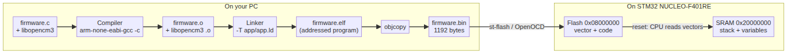
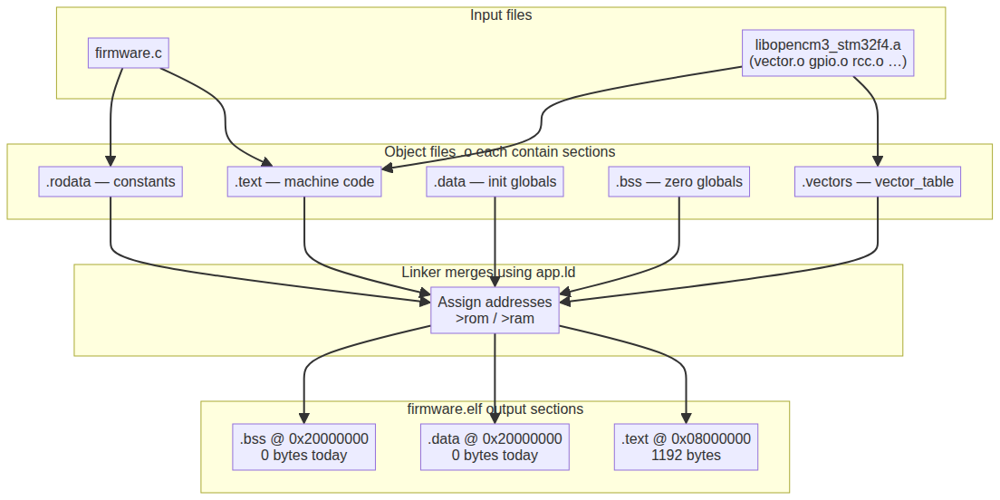
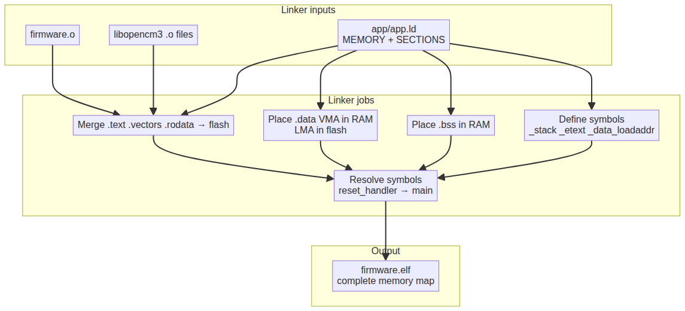
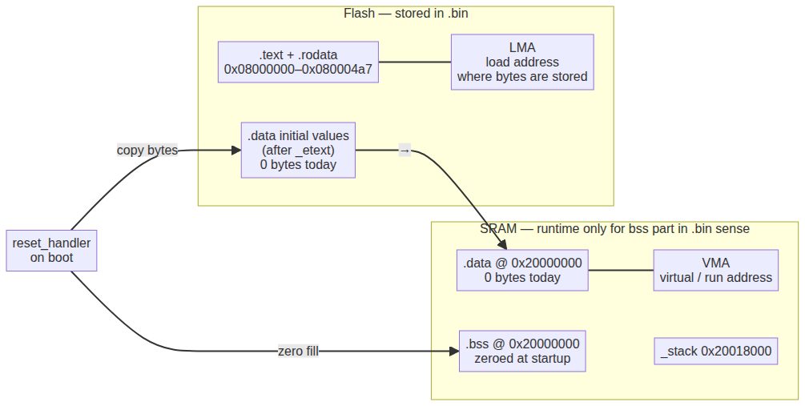
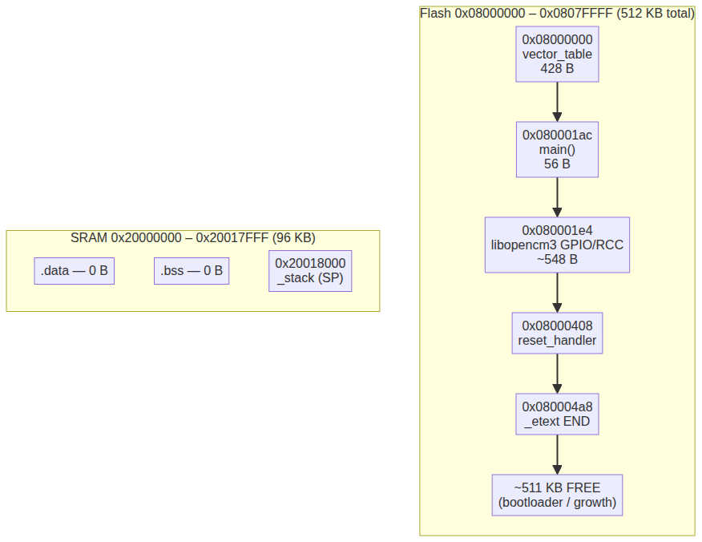
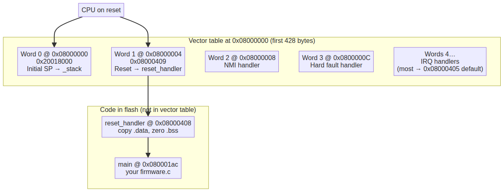
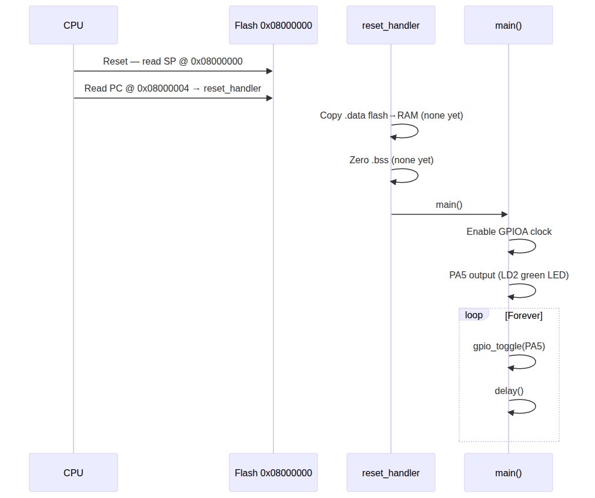

# Linker Scripts, Sections & the Vector Table — A Complete Guide

**For this project:** NUCLEO-F401RE · STM32F401RET6 · `app/app.ld` · `app/src/firmware.c`

This guide walks from **C source on your PC** to **bytes in flash** to **what the CPU does on reset**, using **real numbers** from your current `firmware.elf` build.

**Related:** [linker-script-and-memory.md](linker-script-and-memory.md) (shorter reference) · [README.md](README.md) (how to re-render diagrams)

---

## Table of contents

1. [The big picture: four different “programs”](#1-the-big-picture-four-different-programs)
2. [What the compiler produces (.o files)](#2-what-the-compiler-produces-o-files)
3. [What the linker does (and why you need a linker script)](#3-what-the-linker-does-and-why-you-need-a-linker-script)
4. [Your linker script line by line](#4-your-linker-script-line-by-line)
5. [Sections → flash/RAM: VMA, LMA, and load addresses](#5-sections--flashram-vma-lma-and-load-addresses)
6. [Sizes: what `arm-none-eabi-size` tells you](#6-sizes-what-arm-none-eabi-size-tells-you)
7. [Your firmware’s actual memory map](#7-your-firmwares-actual-memory-map)
8. [The vector table (the most important bytes in flash)](#8-the-vector-table-the-most-important-bytes-in-flash)
9. [Reset to `main()`: step by step](#9-reset-to-main-step-by-step)
10. [From `.elf` to `.bin` to the chip](#10-from-elf-to-bin-to-the-chip)
11. [Why size matters (especially for bootloaders)](#11-why-size-matters-especially-for-bootloaders)
12. [Glossary](#12-glossary)

---

## 1. The big picture: four different “programs”

People mix these up. They run at **different times** on **different machines**:

| Tool | Runs on | Input | Output | Role |
|------|---------|-------|--------|------|
| **Compiler** (`arm-none-eabi-gcc -c`) | Your PC | `firmware.c` | `firmware.o` | Turn C into machine code **fragments** |
| **Linker** (`arm-none-eabi-gcc … -T app.ld`) | Your PC | `.o` + libraries | `firmware.elf` | **Place** code/data at final addresses |
| **Objcopy** (`arm-none-eabi-objcopy`) | Your PC | `.elf` | `firmware.bin` | Strip to raw flash bytes |
| **Your firmware** | STM32 chip | Flash contents | LED blinks | Actually runs on the MCU |



**The linker script (`app/app.ld`) is instructions for the linker only.**  
It never runs on the Nucleo. It answers: *“Put the vector table at 0x08000000, put `.bss` in RAM, set `_stack` to the top of SRAM, …”*

---

## 2. What the compiler produces (.o files)

When you run:

```sh
arm-none-eabi-gcc -c app/src/firmware.c -o firmware.o
```

the compiler **does not** know final addresses like `0x080001ac`. It only emits **sections** — named buckets of bytes:

| Section | Typical contents | Lives in `.o` as |
|---------|------------------|------------------|
| `.text` | Machine instructions (`main`, `gpio_toggle`, …) | Flash-bound code |
| `.rodata` | `const` data, string literals | Read-only flash |
| `.data` | **Initialized** global/static variables | RAM at run time, **initial values stored in flash** |
| `.bss` | **Uninitialized** global/static variables (start as zero) | RAM only |
| `.vectors` | Vector table (from libopencm3) | Special flash |

Your blinky has **no global variables**, so `firmware.o` contributes almost only `.text`.

libopencm3 is already compiled into `libopencm3_stm32f4.a`. Those archives are **collections of `.o` files** — the linker pulls in what it needs (`vector.o`, `gpio.o`, `rcc.o`, …).



---

## 3. What the linker does (and why you need a linker script)

The linker:

1. **Merges** all `.text` from every `.o` into one `.text` output section.
2. **Assigns addresses** using `app/app.ld` (`>rom`, `>ram`).
3. **Resolves symbols** — connects `reset_handler` call sites to the real function, `main` references, etc.
4. **Drops** unused code (with `-Os`, `--gc-sections` if enabled).
5. Produces **`firmware.elf`** with a **memory map** and debug info.

Without a linker script, the linker would not know that flash starts at `0x08000000` on STM32.



Key symbols the linker **creates** from your script (used by startup code):

| Symbol | Your build value | Meaning |
|--------|------------------|---------|
| `_stack` | `0x20018000` | Initial stack pointer |
| `_etext` | `0x080004a8` | End of flash-resident code/rodata |
| `_data` / `_edata` | `0x20000000` (empty) | Range of initialized RAM data |
| `_data_loadaddr` | `0x080004a8` | Where `.data` initial values sit in flash |
| `_ebss` | `0x20000000` (empty) | End of zero-init RAM |

---

## 4. Your linker script line by line

File: `app/app.ld`

### Memory regions

```ld
MEMORY {
    rom (rx)  : ORIGIN = 0x08000000, LENGTH = 512K
    ram (rwx) : ORIGIN = 0x20000000, LENGTH = 96K
}
```

This mirrors the STM32 memory map. Names `rom`/`ram` are arbitrary labels used below in `>rom` / `>ram`.

### Force the vector table and entry point

```ld
EXTERN(vector_table)
ENTRY(reset_handler)
```

- **`vector_table`** — defined in libopencm3; linker must keep it even if nothing references it directly.
- **`ENTRY(reset_handler)`** — ELF “entry point” for debuggers; **hardware still uses the vector table**, not this symbol directly.

### `.text` section (flash)

```ld
.text : {
    *(.vectors)    /* MUST be first — CPU reads 0x08000000 on reset */
    *(.text*)
    *(.rodata*)
} >rom
```

**Order matters:** `.vectors` first so `vector_table` sits at `0x08000000`.

Everything in `.text` for your build:

```
0x08000000  vector_table     428 bytes  (0x1ac)
0x080001ac  main              56 bytes  (0x38)
0x080001e4  gpio_* + rcc_*   ~540 bytes (libopencm3)
0x08000404  default IRQ handlers (weak)
0x08000408  reset_handler
0x080004a8  _etext (end)
```

### `.data` — RAM address, flash backup

```ld
.data : { … } >ram AT >rom
_data_loadaddr = LOADADDR(.data);
```

See [section 5](#5-sections--flashram-vma-lma-and-load-addresses). Your blinky: **0 bytes** (no globals).

### `.bss` — zero-filled RAM

Uninitialized globals. Also **0 bytes** in your blinky.

### Stack

```ld
PROVIDE(_stack = ORIGIN(ram) + LENGTH(ram));  /* 0x20018000 */
```

First word of the vector table points here.

---

## 5. Sections → flash/RAM: VMA, LMA, and load addresses

Every output section has:

| Term | Meaning | Example (`.data`) |
|------|---------|-------------------|
| **VMA** | Address when **running** on chip | RAM: `0x20000000` |
| **LMA** | Address in **flash image** / `.bin` | Flash: after `_etext` |

On reset, `reset_handler` copies bytes from LMA → VMA for `.data`, then zeros `.bss`.



Your build (from `readelf -l firmware.elf`):

```
LOAD  VirtAddr=0x08000000  FileSiz=0x4a8  (flash: .text only)
LOAD  VirtAddr=0x20000000  PhysAddr=0x080004a8  MemSiz=0  (.data/.bss empty)
```

---

## 6. Sizes: what `arm-none-eabi-size` tells you

```sh
arm-none-eabi-size firmware.elf
   text    data     bss     dec     hex
   1192       0       0    1192     4a8
```

| Column | What it counts | Your value | Goes to |
|--------|----------------|------------|---------|
| **text** | Code + `.rodata` + vectors in flash | 1192 B | Flash (`.text` program header) |
| **data** | Initialized globals | 0 B | RAM (values also stored in flash when non-zero) |
| **bss** | Zero-init globals | 0 B | RAM only (not in `.bin`) |
| **dec/hex** | Total **runtime** footprint in RAM+flash | 1192 B | — |

**Important:** `.bss` is **not** in the `.bin` file — startup zeroes it. If you add `static uint8_t buf[4096];`, **bss jumps by 4096** but **`.bin` size may not change**.

Debug sections (`.debug_*`) add ~80 KB to the **ELF file** but are **not flashed** to the chip.

---

## 7. Your firmware’s actual memory map

512 KB flash total; your app uses **1192 bytes (0.23%)**.



### Flash detail (first 0x500 bytes)

```
Address     Size   Content
──────────────────────────────────────────────────
0x08000000  428 B  vector_table (.vectors)
0x080001ac   56 B  main()          ← your firmware.c
0x080001e4  ~548 B libopencm3 GPIO/RCC + weak IRQ stubs
0x08000408    —   reset_handler   (startup, calls main)
0x080004a8    —   _etext (end of used flash)
0x080004a8  …     (free flash — ~511 KB left)
0x08080000        (end of 512 KB flash)
```

### SRAM

```
0x20000000  .data / .bss  (empty today)
    …
0x20018000  _stack  ← initial SP (vector word 0)
```

---

## 8. The vector table (the most important bytes in flash)

On **every reset**, the Cortex-M4 hardware:

1. Reads **word at `0x08000000`** → loads into **SP** (stack pointer)
2. Reads **word at `0x08000004`** → loads into **PC** (program counter) and starts executing

That is **hardwired**. No linker script runs on the chip — the CPU expects this layout.



### Your actual first bytes (from `objdump`)

```
Address    Hex value     Meaning
─────────────────────────────────────────────────────
0x08000000 0x20018000    Initial SP → top of 96 KB RAM
0x08000004 0x08000409    Reset vector → reset_handler (Thumb: odd address)
0x08000008 0x08000405    NMI handler (default)
0x0800000C 0x08000405    Hard fault handler (default)
   …       0x08000405    Most IRQ slots → weak default handler at 0x08000404
```

`0x08000409` = `reset_handler` at `0x08000408` **OR 1** (Thumb mode bit).

### Where `vector_table` comes from

libopencm3 defines it in `libopencm3/lib/cm3/vector.c`:

```c
__attribute__((section(".vectors"), used))
vector_table_t vector_table = {
    .initial_sp_value = &_stack,
    .reset = reset_handler,
    .nmi = nmi_handler,
    /* … every IRQ name for this chip … */
};
```

The linker script line `*(.vectors)` **places this struct at the start of flash**.

### Vector table size

`vector_table` spans **`0x08000000`–`0x080001ab`** (428 bytes = 107 entries × 4 bytes).  
That includes **system exceptions + all STM32F401 IRQ vectors**. Most point to tiny default handlers until you override them.

### `main()` is NOT in the vector table

| Symbol | In vector table? | Address |
|--------|------------------|---------|
| `reset_handler` | Yes (word 1) | `0x08000408` |
| `main` | **No** | `0x080001ac` |
| `main` | Called **from** `reset_handler` after init | — |

---

## 9. Reset to `main()`: step by step



| Step | What happens |
|------|----------------|
| 1 | Power-on / reset button |
| 2 | CPU reads SP=`0x20018000`, PC=`reset_handler` from `0x08000000`/`04` |
| 3 | `reset_handler` copies `.data` flash→RAM (nothing to copy today) |
| 4 | `reset_handler` zeros `.bss` (nothing today) |
| 5 | `reset_handler` calls **`main()`** at `0x080001ac` |
| 6 | `main()` enables GPIOA, configures PA5, loops toggle+delay |

`reset_handler` excerpt:

```c
void reset_handler(void) {
    /* copy .data using _data_loadaddr, _data, _edata */
    /* zero .bss using _ebss */
    (void)main();
}
```

---

## 10. From `.elf` to `.bin` to the chip

```
firmware.c  ──compile──►  firmware.o  ──┐
libopencm3.a (many .o)  ──────────────┼──link (app.ld)──► firmware.elf
                                       │
                                       └──objcopy──► firmware.bin
                                                         │
                                              st-flash / OpenOCD
                                                         │
                                                         ▼
                                              Flash @ 0x08000000
```

| File | Contains |
|------|----------|
| `firmware.elf` | Flash **and** debug symbols, sections, ELF headers |
| `firmware.bin` | **1192 bytes** of raw flash — exactly what gets programmed |
| On chip | Same bytes at `0x08000000` … `0x080004a7` |

`make flash-stlink` writes **`firmware.bin` to `APP_FLASH_ADDR` (`0x08000000`)** — must match `APP_FLASH` in `app.ld`.

---

## 11. Why size matters (especially for bootloaders)

Today: **1192 B** of **524288 B** flash — plenty of room.

Size matters when you split flash:

```
Future layout (typical):
0x08000000  16 KB   bootloader   ← must never grow past this region
0x08004000  rest    application  ← your firmware.c linked here
```

| Concern | Why |
|---------|-----|
| **Flash limit** | Bootloader + app must fit in 512 KB |
| **Sector alignment** | STM32F401 erases in **16 KB** sectors — bootloader region often one or more full sectors |
| **Vector table location** | App at `0x08004000` must set **`SCB_VTOR = 0x08004000`** so interrupts work |
| **RAM** | Stack + `.bss` + `.data` must fit in 96 KB; large buffers grow **bss** |
| **`.bin` vs runtime RAM** | Big `.bss` increases RAM use **without** increasing `.bin` size |

Commands to inspect as your project grows:

```sh
arm-none-eabi-size firmware.elf
arm-none-eabi-nm -S -n firmware.elf | less
arm-none-eabi-objdump -h firmware.elf
```

---

## 12. Glossary

| Term | Plain English |
|------|----------------|
| **Linker script** | Address/layout recipe for the linker (PC tool) |
| **Section** | Named bucket of bytes (`.text`, `.data`, …) |
| **VMA** | “Run at this address on the chip” |
| **LMA** | “Stored at this address in flash file” |
| **Vector table** | First words in flash; CPU reads on reset |
| **`.vectors`** | ELF section holding `vector_table` |
| **`ENTRY`** | ELF entry symbol (debug/loader); reset still uses vector table |
| **`_stack`** | Initial stack pointer value |
| **`_etext`** | End of code/constants in flash |
| **ROM / flash** | Non-volatile; program stored here |
| **RAM** | Volatile; variables and stack |
| **`.elf`** | Linked program + metadata |
| **`.bin`** | Raw bytes programmed into flash |

---

## Quick commands cheat sheet

```sh
make
arm-none-eabi-size firmware.elf
arm-none-eabi-nm firmware.elf | grep -E 'vector|reset|main|_stack|_etext'
arm-none-eabi-objdump -d firmware.elf | less
arm-none-eabi-objdump -s --start-address=0x08000000 --stop-address=0x08000040 firmware.elf
```

Regenerate diagram PNGs after editing `.mmd` files:

```sh
cd info && ./render.sh
```
