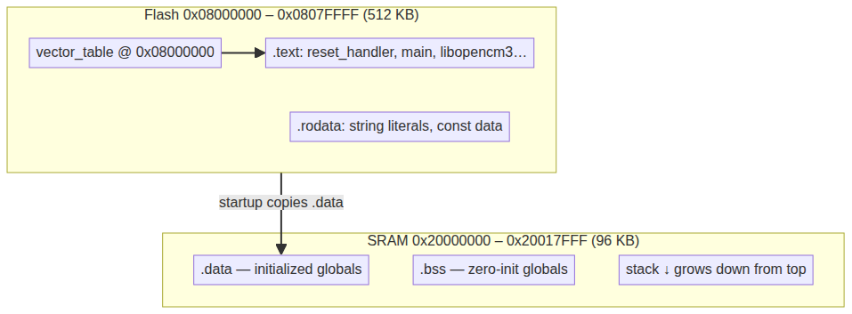
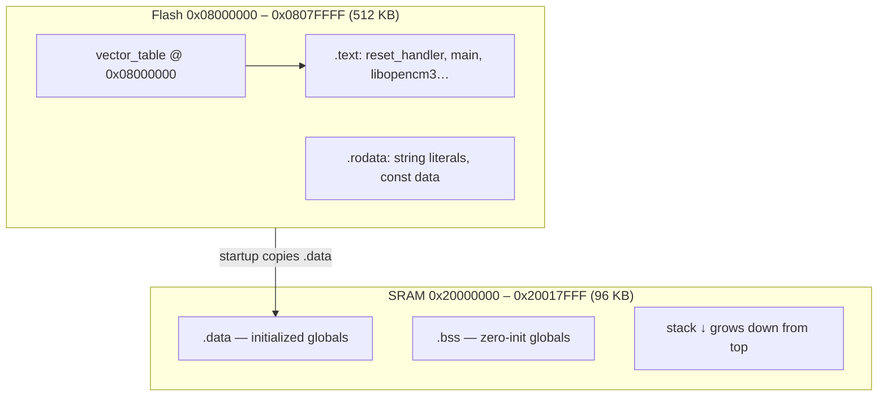
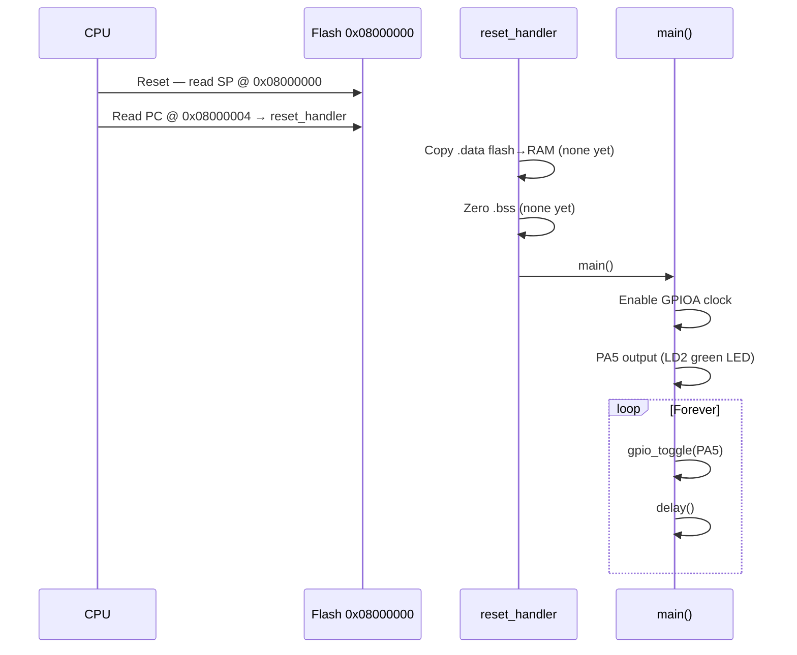

# Linker Script & Memory Layout — NUCLEO-F401RE

Reference for how **`app/app.ld`**, **`app/src/firmware.c`**, and libopencm3 work together on the **STM32F401RET6** (NUCLEO-F401RE).

Related files:

| File | Role |
|------|------|
| `app/app.ld` | Custom linker script (flash/RAM map, sections) |
| `app/src/firmware.c` | Application `main()` |
| `Makefile` | Builds `firmware.elf`, flashes @ `0x08000000` |
| `libopencm3/lib/cm3/vector.c` | Vector table + `reset_handler` → `main()` |

Draw.io versions of the diagrams: [`diagrams/memory-map.drawio`](diagrams/memory-map.drawio), [`diagrams/boot-sequence.drawio`](diagrams/boot-sequence.drawio).

---

## Physical memory on the chip

The STM32F401RET6 has two main regions the CPU uses:

| Region | Alias name | Start | Size | Used for |
|--------|------------|-------|------|----------|
| **Flash** | ROM | `0x08000000` | 512 KB | Code, constants, vector table |
| **SRAM** | RAM | `0x20000000` | 96 KB | Stack, globals, initialized data |

The linker script names them `rom` and `ram`:

```ld
APP_FLASH = 0x08000000;
APP_RAM   = 0x20000000;

MEMORY
{
    rom (rx)  : ORIGIN = APP_FLASH, LENGTH = 512K
    ram (rwx) : ORIGIN = APP_RAM,   LENGTH = 96K
}
```

This matches ST’s memory map and `st-info` output (512 KB flash, 96 KB SRAM).

### Memory map diagram



<details><summary>Mermaid source (renders in GitHub / Cursor chat)</summary>



</details>

---

## What the linker script does

The linker script does **not** run on the MCU. It tells the **linker** (on your PC):

1. **Where** each section goes in flash/RAM (addresses).
2. **What order** sections are placed.
3. **Symbols** startup code needs (`_stack`, `_data`, `_etext`, etc.).

### Key directives

```ld
EXTERN(vector_table)
ENTRY(reset_handler)
```

| Directive | Meaning |
|-----------|---------|
| `EXTERN(vector_table)` | Force inclusion of libopencm3’s vector table symbol |
| `ENTRY(reset_handler)` | ELF entry point after reset — **not** `main()` directly |

### Section: `.text` → flash (ROM)

```ld
.text : {
    *(.vectors)
    *(.text*)
    . = ALIGN(4);
    *(.rodata*)
    . = ALIGN(4);
} >rom
```

| Content | Examples |
|---------|----------|
| `.vectors` | Interrupt vector table at **start of flash** |
| `.text*` | `reset_handler`, `main`, `gpio_toggle`, delay loop |
| `.rodata*` | String literals, `const` data |

### Section: `.data` — lives in RAM, **stored** in flash

```ld
.data : {
    _data = .;
    *(.data*)
    ...
} >ram AT >rom
_data_loadaddr = LOADADDR(.data);
```

| Term | Meaning |
|------|---------|
| **VMA** (virtual memory address) | Where variables **run** — in RAM |
| **LMA** (load memory address) | Where initial values are **stored** in the `.bin` — in flash |
| Startup | `reset_handler` copies `[ _data_loadaddr … )` → `[ _data … _edata )` |

Current blinky has **no global variables**, so `.data` and `.bss` are **0 bytes**.

### Section: `.bss` → RAM only

Uninitialized globals; zeroed at startup. Also empty in the current app.

### Stack

```ld
PROVIDE(_stack = ORIGIN(ram) + LENGTH(ram));
```

Initial stack pointer = top of RAM:

```
0x20000000 + 96K = 0x20018000
```

Stack grows **down** toward lower addresses. The vector table’s first word points here.

---

## Actual build layout (`firmware.elf`)

Typical size output:

```
   text    data    bss
   1192       0      0     → ~1.2 KB total
```

| Symbol | Address | Meaning |
|--------|---------|---------|
| `vector_table` | `0x08000000` | CPU reads this on reset |
| `reset_handler` | `0x08000408` | libopencm3 startup |
| `main` | `0x080001ac` | `app/src/firmware.c` |
| `_stack` | `0x20018000` | Initial SP (vector word 0) |
| `_etext` | `0x080004a8` | End of flash-resident code/rodata |

### ASCII flash/RAM map (current firmware)

```
0x08000000  ┌─────────────────────────┐
            │ vector_table (.vectors) │  ← reset: SP + PC from here
0x08000004  │  word1 → reset_handler  │
            │  … IRQ vectors          │
            ├─────────────────────────┤
0x080001ac  │ main()                  │
            │ libopencm3 GPIO/RCC     │
            │ delay loop              │
0x080004a8  ├─────────────────────────┤  _etext
            │ (unused flash)          │  ~510 KB free
0x08080000  └─────────────────────────┘

0x20000000  ┌─────────────────────────┐
            │ .data / .bss (empty)    │
            │                         │
0x20018000  └─ _stack (SP starts)   ┘
```

Inspect anytime:

```sh
arm-none-eabi-size firmware.elf
arm-none-eabi-nm firmware.elf | grep -E 'vector_table|reset_handler| main|_stack|_etext'
arm-none-eabi-objdump -h firmware.elf
```

---

## Boot sequence (reset → blinky)

### Boot sequence diagram


<details><summary>Mermaid source (renders in GitHub / Cursor chat)</summary>



</details>

### Call chain

On Cortex-M, **`main()` is not the hardware entry point**:

1. **Reset** → hardware loads vector table at `0x08000000`
2. **Word 0** → `_stack` (`0x20018000`) loaded into SP
3. **Word 1** → `reset_handler` loaded into PC
4. **`reset_handler`** (libopencm3) → copy `.data`, zero `.bss`, call **`main()`**
5. **`main()`** (your code) → init GPIO, blink loop

libopencm3 implementation (`libopencm3/lib/cm3/vector.c`):

```c
__attribute__((section(".vectors"), used))
vector_table_t vector_table = {
    .initial_sp_value = &_stack,
    .reset = reset_handler,
    /* … IRQ handlers … */
};

void reset_handler(void)
{
    /* copy .data from flash to RAM */
    /* zero .bss */
    (void)main();
}
```

Your project only defines **`main()`** in `firmware.c`. Vectors and startup come from **libopencm3** + **`app/app.ld`**.

---

## Build → flash → run

| Step | What happens |
|------|----------------|
| `make` | Compile `firmware.c` → link with `libopencm3_stm32f4.a` using `app/app.ld` → `firmware.elf` |
| `objcopy` | `firmware.bin` — raw bytes for programming |
| `make flash` | OpenOCD programs ELF, verifies, resets |
| `make flash-stlink` | `st-flash write firmware.bin 0x08000000` |
| Reset | CPU fetches vectors from `0x08000000` again |

**Important:** `APP_FLASH_ADDR` in `Makefile` must match `APP_FLASH` in `app/app.ld` (both `0x08000000` today).

---

## What runs after flash (NUCLEO-F401RE)

1. `main()` enables **GPIOA** clock, configures **PA5** as output (**LD2** green LED).
2. Infinite loop: `gpio_toggle(PA5)`, busy-wait delay.
3. No RTOS, no interrupts used — bare-metal superloop.
4. Clock: default **HSI** after reset (no PLL setup in current code — fine for blinky).

| Nucleo item | Value |
|-------------|-------|
| MCU | STM32F401RET6 |
| User LED | LD2 green, **PA5** |
| ST-LINK USB | **CN1** (not CN2) |
| Flash / debug | OpenOCD or `st-flash` via built-in ST-LINK/V2.1 |

---

## Future: bootloader + application split

Current layout is **standalone** — entire app at `0x08000000` (works without a bootloader).

Typical layout for FW upgrade / “Blinky to Bootloader” style projects:

```
0x08000000  16 KB   bootloader   (permanent, runs first on reset)
0x08004000  rest    application  (your firmware.c project)
```

Changes required later:

1. Set `APP_FLASH = 0x08004000` in `app/app.ld`
2. Early in `main()`: `SCB_VTOR = 0x08004000` (relocate vector table)
3. Flash app with: `st-flash write firmware.bin 0x08004000`
4. Bootloader at `0x08000000` receives new firmware and jumps to app

Until a bootloader exists, keep **`0x08000000`** so cold reset works.

---

## Quick reference

| Question | Answer |
|----------|--------|
| Where is code? | Flash from `0x08000000` (`.vectors`, `.text`, `.rodata`) |
| Where is RAM used? | `0x20000000`; stack top `0x20018000` |
| Linker `ENTRY`? | `reset_handler` |
| Application entry? | `main()` in `app/src/firmware.c` |
| Program flash at? | `0x08000000` |
| Board LED? | PA5 = LD2 (green) |

---

## Diagram files

| File | Format | Description |
|------|--------|-------------|
| [`diagrams/memory-map.png`](diagrams/memory-map.png) | PNG | Rendered memory map (run `info/render.sh`) |
| [`diagrams/boot-sequence.png`](diagrams/boot-sequence.png) | PNG | Rendered boot flow |
| [`diagrams/*.mmd`](diagrams/) | Mermaid | Editable source for PNG/SVG export |
| [`diagrams/*.drawio`](diagrams/) | draw.io | Editable layout (diagrams.net) |

Regenerate PNG/SVG: `cd info && ./render.sh`
